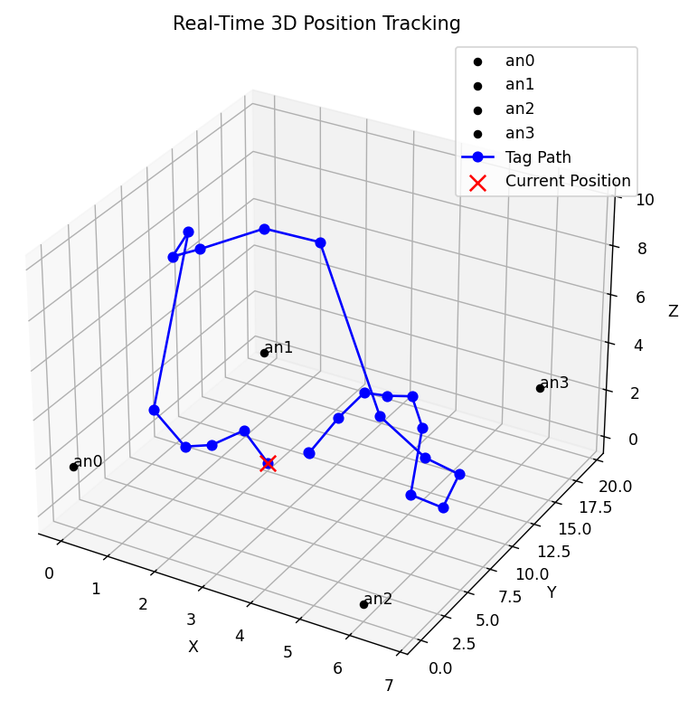

# Images

*Example of a typical setup with **4 anchors** (red ID numbers) and **1 tag** (green ID number).*

*Example of the 2D trajectory display. The "Whiteboard" line is just for reference in the room where it was tested.*

*Example of the 3D trajectory display.*