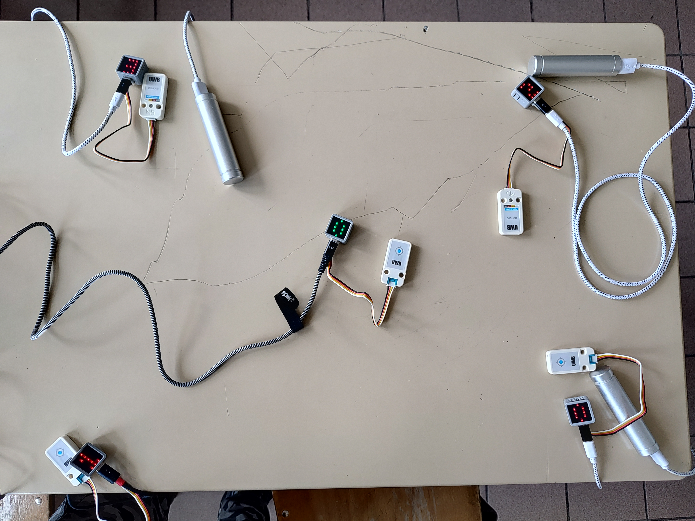

# M5AtomMatrix

This folder contains the **Arduino scripts** used to program the M5 Atom Matrix together with the UWB module.

## Getting Started

* M5 Atom Matrix documentation (Arduino IDE setup and basic usage): https://docs.m5stack.com/en/core/ATOM%20Matrix

* UWB module documentation: https://docs.m5stack.com/en/unit/uwb

> ⚠️ **Note**: The official example provided for the UWB module is designed for the M5 Core controller. It requires adaptation to work properly with the M5 Atom Matrix, which is what we did in this project.

## Scripts Overview

The code is organized for clarity and simplicity into two main roles: **anchor** and **tag**. Below is a description of each script:

* **`Anchor_UWB`**: Configures the UWB module as an **anchor**. 
    > ℹ️ Each anchor must have a **unique ID**, which must be manually set in the script

* **`Tag_UWB`**: Configures the UWB module as a **tag**. By default, the tag is responsible for measuring distances to all visible anchors. This version sends the distance data via **serial (UART) communication**.
    > ℹ️ Unlike anchors, it is **not strictly necessary** for the tag to have a unique ID, since the UWB module **only supports one tag at a time**. However, setting an ID may still be useful for debugging or clarity.

* **`Tag_UWB_WiFi`**: An extended version of the previous script that also transmits the distance data via **Wi-Fi using TCP**, while keeping the serial output for debugging.

* **`Helpful_Programs`**: A collection of utility scripts used for testing and development purposes:

    * `ShowNumber`: Displays the device's ID on the M5 Atom Matrix LED screen.
        * Red: anchor
        * Green: tag 
        > ✅ This is included in all main scripts.

    * `WiFi_SoftAP`: Turns the M5 Atom Matrix into a Wi-Fi access point (**SoftAP mode**). This was considered as an alternative for wireless communication between tag and computer.

## System Setup Example

The following image shows a typical setup with **4 anchors** (red ID numbers) and **1 tag** (green ID number) placed in the middle:

