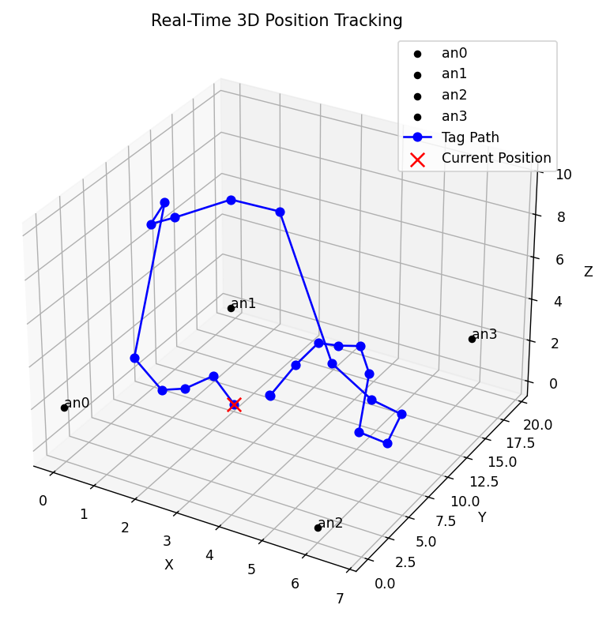

# Scripts

This folder contains the **Python scripts** used to calculate the position from the measured distances (using Trilateration or Multilateration) and to visualize the position in real time.

## Scripts Overview

The two main script groups are:

### 🔸 Multilateration Scripts

These scripts receive range information sent by the UWB tag, process and clean the data, perform position calculations, and save the computed positions in a **CSV file** during runtime.

- **`2D_Multilateration`**  
  - Reads data from **serial communication**.  
  - Calculates 2D position using distances from **4 anchors**.  
  - Since this leads to an **overdetermined system** (3 linearized equations, 2 unknowns: `x`, `y`), the system is solved using **least squares** with `numpy`'s function:  
    ```python
    np.linalg.lstsq(A, b)
    ```

- **`TCP_2D_Multilateration`**  
  - Similar to the above, but receives distance data via a **TCP server** instead of serial.

- **`3D_Multilateration`**  
  - Reads distance data via **serial**.  
  - Calculates 3D position (`x`, `y`, `z`).  
  - Since it involves 3 linearized equations and 3 unknowns, it can be solved **directly** without the need for least squares.

- **`3D_MultilaterationFunction.ipynb`**  
  - A **Python notebook** that explains the **mathematical derivation** behind the 3D multilateration function.  
  - For a deeper explanation, refer to the **project report** in the `Docs/` folder.

### 🔸 Visualization Scripts

These scripts read the position data from the **CSV file** and plot the movement in real time using `matplotlib`.

- **`2D_Visualization`**  
  - Plots the **current 2D position** on a plane.  
  - Displays the **entire trajectory** up to the current point.

- **`3D_Visualization`**  
  - Plots the **current 3D position** and trajectory in a 3D space.

## Other Scripts

These auxiliary scripts were written to test basic features during development:

- **`Test`**: This script just **reads and prints** distance data received from the tag via serial communication.

- **`TCP_Server`**  
  - Similar to `Test`, but sets up a **TCP server** to receive the data over Wi-Fi instead of serial.

## Example Output

You can find:

- **An example of the output CSV file**, containing the calculated positions over time.
- **Screenshots of the real-time visualizations** (2D and 3D graphs)

These are available in the [`Docs`](../Docs) folder.

### Example Screenshots


*Example of the 2D trajectory display. The "Whiteboard" line is just for reference in the room where it was tested.*


*Example of the 3D trajectory display.*